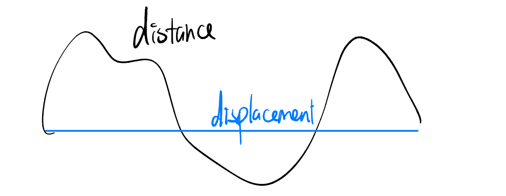

- 运动->力
		|->杠杆
		|->压强
		|->能量

| Scalar标量   | Vector矢量/向量     |
| ---------- | --------------- |
| distance距离 | displacement位移  |
| speed速率    | velocity速度      |
|            | acceleration加速度 |
***formular***
- $v=\frac{s}{t}$
- $a=\frac{v}{t}$

- ***Newton's first law***:No resultant force, object will remain its state of constant velocity or stationaty.
- ***Newton's second law***:$F=ma$
- ***Newton's third law***:action and reaction
 - same magnitude
 - opposite direction

| mass     | vs  | weight                        |
| -------- | --- | ----------------------------- |
| Scalar   |     | vector                        |
| kg       |     | N                             |
| constant |     | change by gravitational field |

 >$w = mg$
 >$g = 10N/kg$***(field strength)***
 >   $=10m/s^2$***(accelerantion)***

***friction opposes motion or tendancy of motion***

***Air resistance***
1. Velocity
2. Area
  **free fall**
  
  