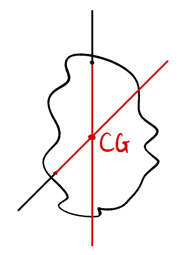

## Moment力矩(旋转)
clockwise(顺)/anti-clockwise(逆)
$M=Fd$ unit:Nm 

## Principle of moment(POM)
Equilibrium 平衡
- Translational 平移=>合力=N
- rotational 旋转=>合力矩=0Nm
>When a body is in equilibrium,the __sum of clockwise moment__ about __any pivot__ is equal to the __sum of anti-clockwise moment__ about the same pivot.
## Centre of Gravity(重心)
- suspensin悬挂
	- 物体只受拉力和重力
	- ***平衡=>重心和支点同一线***
	
	
## Stability 稳定性
- 重心越低越稳
- 底面积越大越稳
