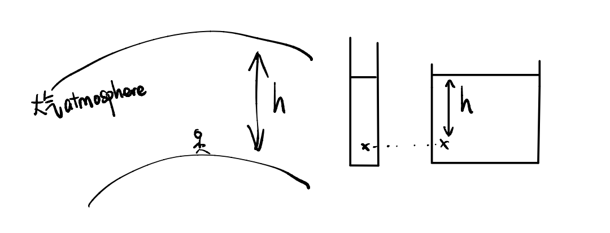

## Pressure 压强
- 固体$p=\frac{F}{A}$
- 液体/气体$p=\rho gh$
	
## 压强的应用
1. hydraulic press 液压机
2. barometer 大气压
3. manometer 气压表
	***Hydraulic press 液压机***
	
	- P equal,$\frac{F_小}{A_小}=\frac{F_大}{A_大}$
	- 不可以有气泡/气体，因为气体可压缩compressible
	- 液压机使用油，因为油可以润滑减小摩擦,reduce friction
	***Barometer 大气***
	
	- $1\ atm=76cmHg=760mmHg=1.01\times 10^5Pa$,$1\ bar=1\times 10^5 Pa$
	- $\rho gh=13600\times 10\times 0.76$
	***Manometer 气压表***
	- $气压差=\rho gh$
	- $P_{gas}=\rho gh+P_{atm}$
	
