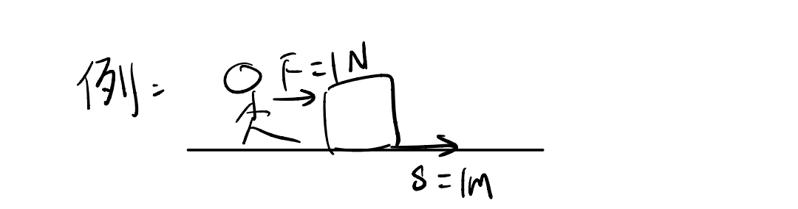

# Energy
- Kinetic Energy $KE=\frac{1}{2}mv^2$
- Gravitational potential $GPE=mgh$
>能量可以做功，做功可以转换能量
>
>你对他做1J的功，
>逆消耗了1J的内能，
>他获得了1J的动能。

 $W=Fs=1\times 1=1J$
## Power 功率
$P=\frac{W}{t}=\frac{E}{t}$
Weight->Work down->Watt(都是W)
## Efficiency 效率
$\frac{有用的}{全部的}\times 100\%$
