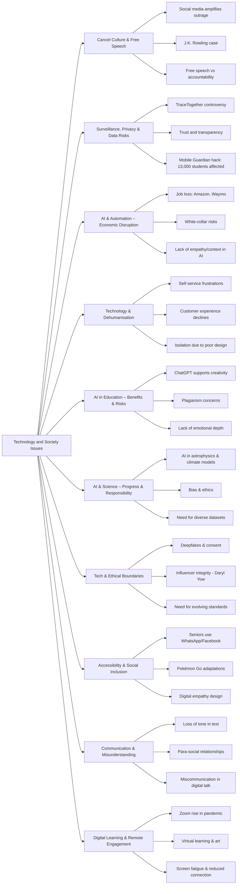

```mermaid

graph LR

A["Technology and Society Issues"]

A1["Cancel Culture & Free Speech"]
A1 --> A1a["Social media amplifies outrage"]
A1 --> A1b["J.K. Rowling case"]
A1 --> A1c["Free speech vs accountability"]

A2["Surveillance, Privacy & Data Risks"]
A2 --> A2a["TraceTogether controversy"]
A2 --> A2b["Trust and transparency"]
A2 --> A2c["Mobile Guardian hack: 13,000 students affected"]

A3["AI & Automation – Economic Disruption"]
A3 --> A3a["Job loss: Amazon, Waymo"]
A3 --> A3b["White-collar risks"]
A3 --> A3c["Lack of empathy/context in AI"]

A4["Technology & Dehumanisation"]
A4 --> A4a["Self-service frustrations"]
A4 --> A4b["Customer experience declines"]
A4 --> A4c["Isolation due to poor design"]

A5["AI in Education – Benefits & Risks"]
A5 --> A5a["ChatGPT supports creativity"]
A5 --> A5b["Plagiarism concerns"]
A5 --> A5c["Lack of emotional depth"]

A6["AI & Science – Progress & Responsibility"]
A6 --> A6a["AI in astrophysics & climate models"]
A6 --> A6b["Bias & ethics"]
A6 --> A6c["Need for diverse datasets"]

A7["Tech & Ethical Boundaries"]
A7 --> A7a["Deepfakes & consent"]
A7 --> A7b["Influencer integrity - Daryl Yow"]
A7 --> A7c["Need for evolving standards"]

A8["Accessibility & Social Inclusion"]
A8 --> A8a["Seniors use WhatsApp/Facebook"]
A8 --> A8b["Pokémon Go adaptations"]
A8 --> A8c["Digital empathy design"]

A9["Communication & Misunderstanding"]
A9 --> A9a["Loss of tone in text"]
A9 --> A9b["Para-social relationships"]
A9 --> A9c["Miscommunication in digital talk"]

A10["Digital Learning & Remote Engagement"]
A10 --> A10a["Zoom rise in pandemic"]
A10 --> A10b["Virtual learning & art"]
A10 --> A10c["Screen fatigue & reduced connection"]

A --> A1
A --> A2
A --> A3
A --> A4
A --> A5
A --> A6
A --> A7
A --> A8
A --> A9
A --> A10


```

