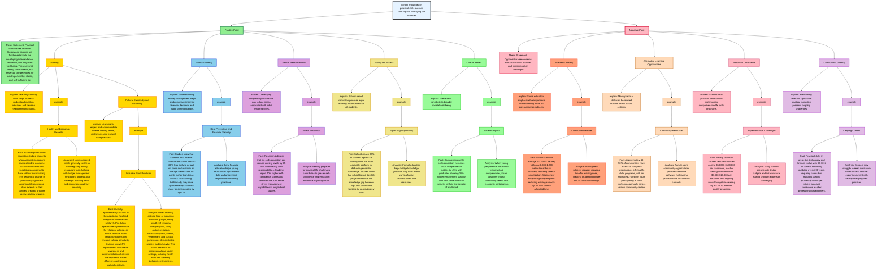

```mermaid
graph TD
    Root["School should teach practical skills such as cooking and managing our finances"]
    
    Root --> Positive["Positive Point"]
    Root --> Negative["Negative Point"]
    
    Positive --> PosThesis["Thesis Statement: Practical life skills like financial literacy and cooking are fundamental tools for developing independence, resilience, and long-term well-being. These are not merely survival skills, but essential competencies for building a healthy, stable, and self-sufficient life."]
    
    Positive --> Cooking["cooking"]
    Cooking --> CookExplain["explain: Learning cooking skills helps students understand nutrition principles and develop healthier eating habits."]
    Cooking --> CookExample["example"]
    CookExample --> CookBenefit["Health and Economic Benefits"]
    CookBenefit --> CookFact["Fact: According to nutrition education studies, students who participate in cooking classes tend to consume 20-30% more fruits and vegetables compared to those without such training. This behavioral change is particularly significant among adolescents and often extends to their families, creating broader positive dietary impacts."]
    CookBenefit --> CookAnalysis["Analysis: Home-prepared meals generally cost less than regularly eating restaurant food, helping with budget management. The cooking process also develops planning skills and encourages culinary creativity."]
    Cooking --> CookCultural["Cultural Sensitivity and Inclusivity"]
    CookCultural --> CookCulturalExplain["explain: Learning to respect and accommodate diverse dietary needs, restrictions, and cultural food practices."]
    CookCultural --> CookCulturalExample["example"]
    CookCulturalExample --> CookCulturalBenefit["Inclusive Food Practices"]
    CookCulturalBenefit --> CookCulturalFact["Fact: Globally, approximately 20-25% of the population has food allergies or intolerances, while 15-20% follow specific dietary restrictions for religious, cultural, or ethical reasons. Food literacy programs that include cultural sensitivity training show 65% improvement in students' awareness and accommodation of diverse dietary needs across different countries and cultural contexts."]
    CookCulturalBenefit --> CookCulturalAnalysis["Analysis: When ordering catered food or preparing meals for groups, being mindful of common allergies (nuts, dairy, gluten), religious restrictions (halal, kosher, vegetarian), and cultural preferences demonstrates respect and inclusivity. This skill is essential for professional and social settings, reducing health risks and fostering inclusive environments."]
    
    Positive --> Finance["financial literacy"]
    Finance --> FinExplain["explain: Understanding money management helps students make informed financial decisions and avoid common pitfalls."]
    Finance --> FinExample["example"]
    FinExample --> FinBenefit["Debt Prevention and Financial Security"]
    FinBenefit --> FinFact["Fact: Studies show that students who receive financial education are 15-20% less likely to default on loans and maintain an average credit score 50 points higher than those without such training. Additionally, they save approximately 2-3 times more for emergencies by age 25."]
    FinBenefit --> FinAnalysis["Analysis: Early financial education helps young adults avoid high-interest debt and understand responsible borrowing practices."]
    
    Positive --> Mental["Mental Health Benefits"]
    Mental --> MentalExplain["explain: Developing competency in life skills can reduce stress associated with adult responsibilities."]
    Mental --> MentalExample["example"]
    MentalExample --> MentalBenefit["Stress Reduction"]
    MentalBenefit --> MentalFact["Fact: Research indicates that life skills education can reduce anxiety levels by 25-35% when facing adult responsibilities. Students report 40% higher self-confidence scores and demonstrate 30% better stress management capabilities in longitudinal studies."]
    MentalBenefit --> MentalAnalysis["Analysis: Feeling prepared for practical life challenges contributes to greater self-confidence and emotional resilience in young adults."]
    
    Positive --> Equity["Equity and Access"]
    Equity --> EquityExplain["explain: School-based instruction provides equal learning opportunities for all students."]
    Equity --> EquityExample["example"]
    EquityExample --> EquityBenefit["Equalizing Opportunity"]
    EquityBenefit --> EquityFact["Fact: Schools reach 95% of children aged 5-18, making them the most equitable platform for delivering essential knowledge. Studies show that school-based life skills programs reduce the knowledge gap between high and low-income families by approximately 60%."]
    EquityBenefit --> EquityAnalysis["Analysis: Formal education helps bridge knowledge gaps that may exist due to varying family circumstances and resources."]
    
    Positive --> Overall["Overall Benefit"]
    Overall --> OverallExplain["explain: These skills contribute to broader societal well-being."]
    Overall --> OverallExample["example"]
    OverallExample --> OverallBenefit["Societal Impact"]
    OverallBenefit --> OverallFact["Fact: Comprehensive life skills education increases adult independence metrics by 45%, with graduates showing 35% higher employment stability and 28% better financial security in their first decade of adulthood."]
    OverallBenefit --> OverallAnalysis["Analysis: When young people enter adulthood with practical competencies, it can positively impact community health and economic participation."]
    
    Negative --> NegThesis["Thesis Statement: Opponents raise concerns about curriculum priorities and implementation challenges."]
    
    Negative --> Academic["Academic Priority"]
    Academic --> AcademicExplain["explain: Some educators emphasize the importance of maintaining focus on core academic subjects."]
    Academic --> AcademicExample["example"]
    AcademicExample --> AcademicBenefit["Curriculum Balance"]
    AcademicBenefit --> AcademicFact["Fact: School curricula average 6-7 hours per day with only 1,000-1,200 instructional hours annually, requiring careful prioritization. Adding new subjects typically requires reducing existing subjects by 10-15% of their allocated time."]
    AcademicBenefit --> AcademicAnalysis["Analysis: Adding new subjects requires reducing time for existing ones, creating challenging trade-offs in curriculum design."]
    
    Negative --> Alternative["Alternative Learning Opportunities"]
    Alternative --> AlternativeExplain["explain: Many practical skills can be learned outside formal school settings."]
    Alternative --> AlternativeExample["example"]
    AlternativeExample --> AlternativeBenefit["Community Resources"]
    AlternativeBenefit --> AlternativeFact["Fact: Approximately 40-50% of communities have access to non-profit organizations offering life skills programs, with an estimated 3-5 million youth participating in such workshops annually across various community centers."]
    AlternativeBenefit --> AlternativeAnalysis["Analysis: Families and community organizations provide alternative pathways for learning practical skills in authentic contexts."]
    
    Negative --> Resource["Resource Constraints"]
    Resource --> ResourceExplain["explain: Schools face practical limitations in implementing comprehensive life skills programs."]
    Resource --> ResourceExample["example"]
    ResourceExample --> ResourceBenefit["Implementation Challenges"]
    ResourceBenefit --> ResourceFact["Fact: Adding practical courses requires facilities costing $50,000-$150,000 per classroom, teacher training investments of $5,000-$10,000 per educator, and ongoing annual budgets increasing by 8-12% to maintain quality programs."]
    ResourceBenefit --> ResourceAnalysis["Analysis: Many schools operate with limited budgets and infrastructure, making program expansion challenging."]
    
    Negative --> Currency["Curriculum Currency"]
    Currency --> CurrencyExplain["explain: Maintaining relevant, up-to-date practical curriculum presents ongoing challenges."]
    Currency --> CurrencyExample["example"]
    CurrencyExample --> CurrencyBenefit["Keeping Current"]
    CurrencyBenefit --> CurrencyFact["Fact: Practical skills in areas like technology and finance evolve with 20-30% of content becoming outdated every 2-3 years, requiring curriculum revisions costing $10,000-$25,000 per subject area and continuous teacher professional development."]
    CurrencyBenefit --> CurrencyAnalysis["Analysis: Schools may struggle to keep curriculum materials and teacher expertise current with rapidly changing best practices."]
    
    classDef rootStyle fill:#E6F3FF,stroke:#333,stroke-width:4px,color:#000
    classDef positive fill:#90EE90,stroke:#2E8B57,stroke-width:3px,color:#000
    classDef negative fill:#FFB6C1,stroke:#DC143C,stroke-width:3px,color:#000
    classDef cooking fill:#FFD700,stroke:#FF8C00,stroke-width:2px,color:#000
    classDef finance fill:#87CEEB,stroke:#4169E1,stroke-width:2px,color:#000
    classDef mental fill:#DDA0DD,stroke:#9370DB,stroke-width:2px,color:#000
    classDef equity fill:#F0E68C,stroke:#DAA520,stroke-width:2px,color:#000
    classDef benefit fill:#98FB98,stroke:#32CD32,stroke-width:2px,color:#000
    classDef academic fill:#FFA07A,stroke:#FF6347,stroke-width:2px,color:#000
    classDef alternative fill:#FFDAB9,stroke:#CD853F,stroke-width:2px,color:#000
    classDef resource fill:#FFB6C1,stroke:#DB7093,stroke-width:2px,color:#000
    classDef currency fill:#E0BBE4,stroke:#BA55D3,stroke-width:2px,color:#000
    
    class Root rootStyle
    class Positive,PosThesis positive
    class Negative,NegThesis negative
    class Cooking,CookExplain,CookExample,CookBenefit,CookFact,CookAnalysis,CookCultural,CookCulturalExplain,CookCulturalExample,CookCulturalBenefit,CookCulturalFact,CookCulturalAnalysis cooking
    class Finance,FinExplain,FinExample,FinBenefit,FinFact,FinAnalysis finance
    class Mental,MentalExplain,MentalExample,MentalBenefit,MentalFact,MentalAnalysis mental
    class Equity,EquityExplain,EquityExample,EquityBenefit,EquityFact,EquityAnalysis equity
    class Overall,OverallExplain,OverallExample,OverallBenefit,OverallFact,OverallAnalysis benefit
    class Academic,AcademicExplain,AcademicExample,AcademicBenefit,AcademicFact,AcademicAnalysis academic
    class Alternative,AlternativeExplain,AlternativeExample,AlternativeBenefit,AlternativeFact,AlternativeAnalysis alternative
    class Resource,ResourceExplain,ResourceExample,ResourceBenefit,ResourceFact,ResourceAnalysis resource
    class Currency,CurrencyExplain,CurrencyExample,CurrencyBenefit,CurrencyFact,CurrencyAnalysis currency
```
